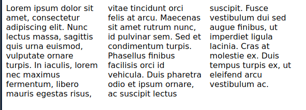

Whenever we think of responsive or amazing layouts, grids of flexbox are our first options. `float`s `inline-blocks` and so on are slowly fading in its usage for layouts. But mind me say that, responsiveness is not all about grids and flexbox. Yes, they make complex layouts achievable, do the hardwork for us, **perfectly center align our elements (justify-content and align-items to the rescue 😍)** and they are amazing abstractions, but CSS offers a lot of simple-to-use tools which you might also consider.

---

## `column-count`

`column-count` is one powerful, simple-to-use and not so popular tool that helps achieve some of our design desires. Talk about **responsiveness** as a piece of cake.

This property allows us to specify the number of columns a container would have and the browser will try to allocate spaces for the elements while maintaining the three columns.

It accepts four values:

- `integer`: a positve integer greater than or equal to 0 used to specify the number of columns.
- `auto`: which is default value specifies the number of columns based on other properties.
- `inherit`: specifies that the property should be inherited from the parent element.
- `initial`: set to the default value.

We'll be maximizing the benefits of the positive integer in this article. Let's look at some examples:

### Example 1

Let's look at a quick example:

_HTML file_

```html
<div class="container">
  Lorem ipsum dolor sit amet, consectetur adipiscing elit. Nunc lectus massa,
  sagittis quis urna euismod, vulputate ornare turpis. In iaculis, lorem nec
  maximus fermentum, libero mauris egestas risus, vitae tincidunt orci felis at
  arcu. Maecenas sit amet rutrum nunc, id pulvinar sem. Sed et condimentum
  turpis. Phasellus finibus facilisis orci id vehicula. Duis pharetra odio et
  ipsum ornare, ac suscipit lectus suscipit. Fusce vestibulum dui sed augue
  finibus, ut imperdiet ligula lacinia. Cras at molestie ex. Duis tempus turpis
  ex, ut eleifend arcu vestibulum ac.
</div>
```

_CSS file_

```css
.container {
  column-count: 3;
}
```



As seen in the above image, the text is splitted into three columns by the browser. This gives us a starting point of the amazing layouts that can be created. Let's look at another example with some other properties that works with `column-count`.

### Example 2

```html
<div class="container">
  <div class="elem">
    <div></div>
  </div>
  <div class="elem">
    <div></div>
  </div>
  <div class="elem">
    <div></div>
  </div>
  <div class="elem">
    <div></div>
  </div>
  <div class="elem">
    <div></div>
  </div>
  <div class="elem">
    <div></div>
  </div>
  <div class="elem">
    <div></div>
  </div>
</div>
```

```css
.container {
  column-count: 3;
  column-gap: 30px;
  column-rule: 1px solid purple;
  width: 600px;
  margin: 0 auto;
}

.elem {
  display: inline-block;
  margin-bottom: 30px;
  height: 100px;
  background-color: purple;
  width: 100%;
}

.elem:nth-child(1),
.elem:nth-child(2),
.elem:nth-child(5),
.elem:nth-child(6) {
  margin: 0 auto initial;
}

.elem:nth-child(5) {
  height: 140px;
}

.elem:nth-child(2) {
  height: 200px;
}

.elem div {
  height: 60px;
  background-color: yellowgreen;
}
```



### Other properties used

- `column-gap`: this specifies the spaces between the columns.
- `column-rule`: is a combination of `column-rule-width` (the rule between between the columns), `column-rule-style` (the style of the rule) and `column-rule-color` (the color of the rule).

If `inline-block` is not used on the divs, the browser might allow an element to overflow to the next column. You can try it out on the codepen (by clicking the edit option) and removing the inline-block style.

## How about responsiveness?

`column-count` accepts numbers which defines the number of columns as we have seen. With media queries, we can change that number at specific media screen widths. For example:

```css
@media only screen and (max-width: 500px) {
  .container {
    column-count: 2;
    width: 100%;
  }
}
@media only screen and (max-width: 300px) {
  .container {
    column-count: 1;
  }
}
```

You can add these media rules to the css space of the codepen above (when you click the edit option) and try resizing the result space or your browser width to see the columns change.

## Wrap up

I got to discover this tool, while trying to achieve a [mansory layout of blocks](https://www.sitepoint.com/understanding-masonry-layout/) with flexbox. It was difficult because, in a flex container, all elements in a row will have to start from the same top base. So if we had three columns, and the first element in the first row had a lower height than the remaining two on the row, instead of the fourth element to be closer to the first, it will start from the same base which the fifth and six would also.

`flex` and `grid` are awesome tools for layouts, but simple tools like `column-count` are also powerful in their own ways.

Thanks for reading 💛
