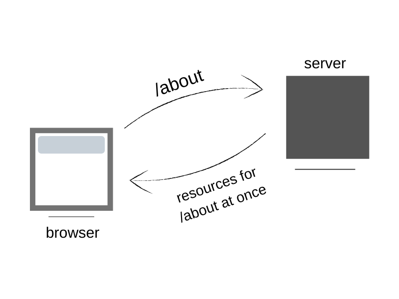

Static site generators (SSGs) are a new and popular technology in creating fast and powerful websites. They are fast because they generate static sites.

As the name implies, these are technologies used to generate static sites from some input files. The type of input files depend on what the SSG supports but the sole aim is to develop (or transform) the files into static contents.

Let's briefly look at what static sites are.

## What are static sites?

Static sites are sites which contain all the files (at once) which a user would need when the site is visited. They are designed and stored on a server which serves the files as requested by the user. The user wouldn't have to wait for the site to request the page's content from another server or a database.

This is in contrast with websites which when visited, would request data from another server or a database somewhere. These are referred to as **dynamic websites**. A common example is a social media application. When you go to facebook.com, you'd get posts queried from a database. Facebook could also generate new contents upon refresh. This emphasizes the dynamic nature.

Static sites are called static because **nothing changes** when browsed. Every user sees the same content. Therefore, static sites do not restrict content to specific users (e.g authenticated users). When more content are added to the site, it is shown to every user.

## Merits of static sites

- **They are fast** because any page requested is gotten immediately, not fetched from somewhere else.
- They contain **reliable data** because the data is constant. The data is gotten from the server as-is.
- **The are very secure** because nothing is changing. When a page is requested, its contents are fetched immediately. This is contrary to dynamic sites which requires background execution of codes to fetch data.
- **They can be hosted on any server**. In dynamic sites, you'd need to be sure that your server accepts the tools you want to use to make your site dynamic but in static sites, as long as the site accepts files, that's all you need.

### Demerits of static sites

- Adding contents become a pain because unlike dynamic sites where the database needs to be updated, static files would require an entire...
- Real-time content like notifications, updates, generally things which require a background code running are not possible because everything is static once the page loads.

Now we see the beauty of static sites. To make things easier, SSGs were created.

## Static Site Generators

You should be familiar with systems like Wordpress and Drupal. They are content management systems which put your data in the database. They work dynamically. Those data are fetched when the associate page is requested.

Now looking at SSGs, they do not put your data in any database. Instead, the data required for any page is loaded for that page while the website is generated.

Examples of SSGs are [Gatsby](https://gatsbyjs.org)(which this site is built with), [Jekyll](https://jekyllrb.com/), [Hugo](https://gohugo.io/) and so on. These technologies accept source files (whose type depends on the technology) which are transformed to static sites.

Example usage of SSGs are blogs, photo gallery, portfolios and so on.

### Content Management Systems (CMS) in SSGs

Some SSGs now support Content Management Systems. This doesn't introduce something dynamic or a database. What happens here is that the source files are saved somewhere like a repository. Then the SSG uses the source files to generate a static site that would be hosted. The CMS allows users to easily manage contents on the repository and upon change of content, the SSG builds the new static site.

## Wrap up

SSGs are becoming the next big thing in tech as many companies are beginning to adopt the concept for their static websites. Added to this is that SSGs can also be configured to work like dynamic sites.

Thanks for reading : )
