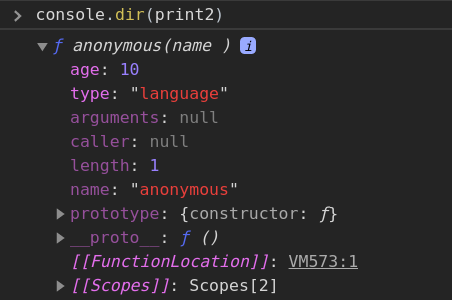

Did you know that functions are also objects in JavaScript?

However, `typeof` would print out `function` as seen below:

```js
function print(name) {
    console.log(name)
}
console.log(typeof print)
// 'function'
```

Functions are not normal objects (with properties and methods), they are called **first-class objects**. The reason for this is that functions can be **called** while objects cannot. This helps Javascript in differentiating between functions and objects.

To confirm that functions are objects, we can use the `instanceof` operator like so:

```js
console.log(print instanceof Object)
// true
```

The `instanceof` checks if the `prototype` property of a constructor (in the above code, `prototype` in `Object`'s constructor) is found anywhere in the prototype chain of an object (in the above code, `print`).

For more confirmation, we can check the properties of `print` and also analyze the prototype chain. Let's check it out:

```js
console.dir(print)
```

_`console.dir` displays an interactive list of the properties of the specified Javascript object (source [MDN docs](dd))._

In the picture above, you can see some properties of `print` (just like objects) and the `__proto__` property of `print`s prototype which has a constructor of `Object`. This is confirmation that `print` is an instance of `Object`.

Check out this article [Understanding Javascript Prototype and Prototype Chain](https://dillionmegida.com/p/understanding-the-prototype-chain-in-javascript/) to learn more about prototypes.

## The function constructor - `Function`

A function has a string that holds the code to be executed when it is called. A function also has a constructor which though, is not recommended, is used in creating functions. It is used like this (to implement our `print` function above):

```js
const print2 = new Function("name", "console.log(name)")
print2("javascript")
// javascript
```

With the above, it is obvious now that `print2` holds the codes that would be executed (just like `print` also holds its own code). `console.log(print2)` will print out that string.

## Functions have object features

Functions could be referred to as **function-object combo** because they work like functions (the `call`-ability) and like objects (properties and methods).

For the variable `print2` above, we could start adding properties justl like a normal object. For example:

```js
print2.type = "language"
print2.age = 10
console.log(print2)
// function code
console.dir(print2)
// check out the image below
```



`print2` prints out the code contained in the function but it has properties (which includes `type` and `age` that we've added) which `console.dir` allows us to see.

## Functions can have methods too

```js
print2.type = "language"
print2.showType = function() {
    console.log(this.type)
}
print2.showType()
// language
```

`this` variable references the object (`print2`) which called the function. `print2` as an object has a type of 'language' hence, `this.type` is language.

Learn more about `this` in this article - [Almighty this, demystified](https://dillionmegida.com/p/this-demystified/)

## Which means functions are also copied by reference

```js
const func1 = function() {
    console.log("func")
}
const func2 = func1
func2()
// func
func2.type = "function"
console.log(func1.type)
// function
<!--
-->
func2 = function() {
    console.log("new func");
}
func2()
// new func
console.log(func2.type)
// undefined
func1()
// func
```

JavaScript objects are copied by reference, hence, functions too. But as you'd have observe, when `func2` was assigned another function-object, a new function-object was created and reference to the other object was deleted.

## Wrap up

Everything objects can do, functions also can. I mean why not? When functions are not just objects but **first-class** ones?

I believe with this article, you have a better understanding of the way functions work in Javascript. Thanks for reading : )
